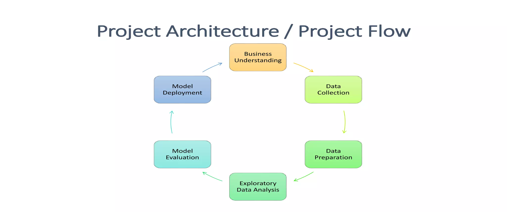
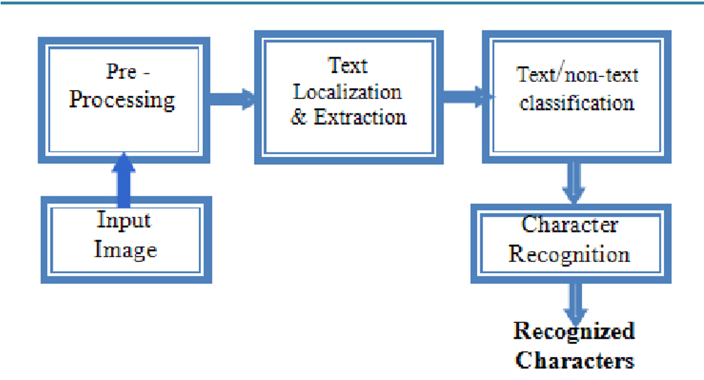
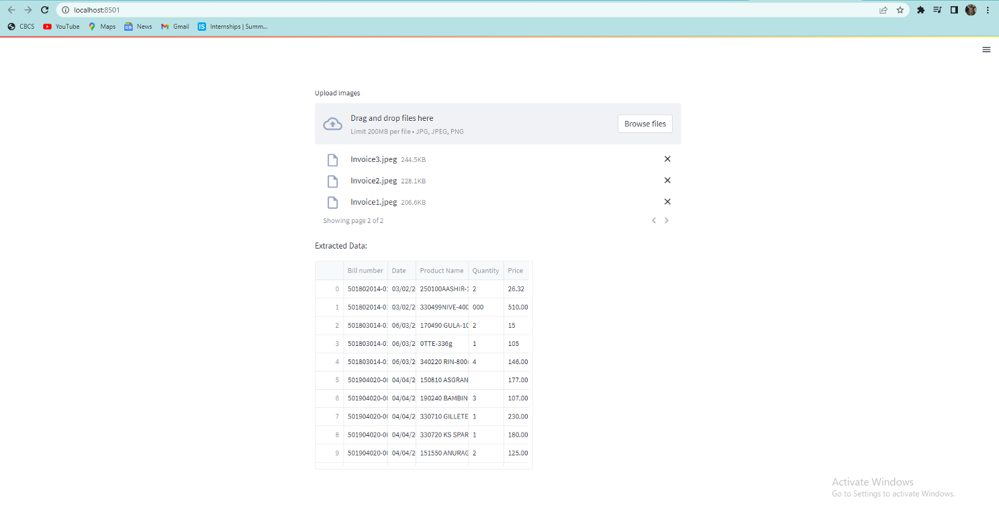

# Text-Extraction-from-store-bills
# Text Extraction from Store Bills (OCR-Based Data Extraction)
# Project Overview

This project automates the extraction of key information from retail store bills using Optical Character Recognition (OCR) techniques. Manual entry of invoice data is both time-consuming and error-prone — this pipeline ensures high accuracy, scalability, and efficiency in extracting structured data from unstructured bill images.

The system processes Walmart and DMart invoice images to extract details such as bill number, date, product names, quantity, rate, and total value. It integrates OCR models with Python, PaddleOCR, and Regular Expressions for post-processing and validation.

# Business Objective

## Goal: Minimize the time required to extract text from retail bills.
## Constraints: Reduce manual effort and human error while maintaining high accuracy.
## Methodology: Implemented using the CRISP-ML(Q) framework with six stages:

Business and Data Understanding

Data Preparation

Model Building

Model Evaluation

Model Deployment

Monitoring and Maintenance

System Architecture

## Pipeline Steps:

Image Input: Accept raw image files (JPG, PNG) from retail stores.

Preprocessing: Binarization, Skew Correction, Noise Removal, Contrast Enhancement, and Normalization.

Segmentation: Detect lines and words for region-based text extraction.

Feature Extraction: Detect and recognize text patterns.

Post-Processing: Apply Regex for structured data extraction.

Output: Return clean, structured text in tabular or database-ready format.

# Technologies Used

Programming Language: Python
OCR Libraries: PaddleOCR, EasyOCR, Tesseract
Frontend / Deployment: Streamlit
Database: MySQL
Environment: Jupyter Notebook, Anaconda
Version Control: GitHub

# Data Collection and Understanding

Source: Retail store bills (DMart / Walmart).
Format: JPEG images of invoices.
Fields Extracted: Bill Number, Bill Date, Product Name, Quantity, Rate, and Value.

# Data Preprocessing

Grayscale Conversion to reduce complexity.
Resizing to standardize image dimensions.
Contrast Enhancement to improve text visibility.
Noise Reduction to remove distortions.
Normalization for consistent lighting and intensity.

# Model Development

Three OCR models were tested and compared:

Model	Description	Performance
Tesseract OCR	Open-source OCR engine with multi-language support.	Average accuracy
EasyOCR	PyTorch-based OCR with 42+ language support.	Moderate accuracy
PaddleOCR	Advanced multilingual OCR toolkit with pretrained detection, direction, and recognition models.	Highest accuracy (≈92%)

Best Model: PaddleOCR, enhanced with Regex-based postprocessing for accurate entity extraction.

# Results and Evaluation
Text Extraction Accuracy: 92%
Processing Time Reduction: 90% compared to manual entry
Highlights:
Accurate recognition of item names, quantities, and totals.
Scalable for large batches of invoices.
Real-time insights via integrated dashboards.

# Deployment
Streamlit Web App for uploading and processing images in real time.
MySQL Integration for storing structured output data.
Backend pipeline using OCR and Regex for automated extraction.

# Challenges
Handling low-quality or skewed images.
Ensuring compatibility among OCR model versions.
Efficiently pushing extracted data into databases.

# Future Scope
Integration of real-time OCR for live camera feeds.
Document structure and key-value pair extraction.
Expansion to handle invoices, receipts, and handwritten text.

# Conclusion

This project successfully automates OCR-based text extraction from unstructured store bills, achieving high accuracy, minimal manual effort, and near real-time processing. It establishes a scalable and reliable solution for retail analytics and document automation.

